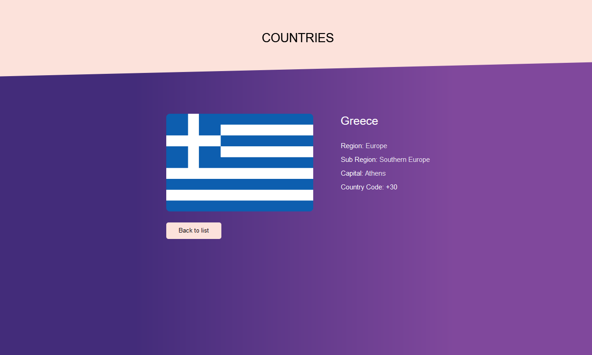

# React Countries 

React countries.

## Browser Compatibility

All of the latest versions of <b>Chrome</b>, <b>Firefox</b>, <b>Edge</b> and <b>Opera</b> browsers are supported.

## Installation

#### Steps to install

<ol>
  <li>download the folder/git clone the repo</li>
  <li>cd root directory of the folder</li>
  <li>npm install</li>
  <li>npm start</li>
  <li>access localhost:3000 on your browser</li>
</ol>

## Screenshots

Homepage with countries.

Country page with each country, its information and Back to list button.

[Back to the top](#react-countries)

See code <a href="https://github.com/veronikagregorec/react-countries/tree/main/src">here</a>
